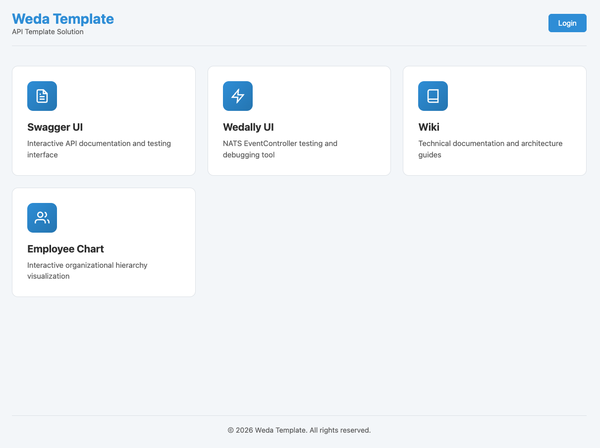
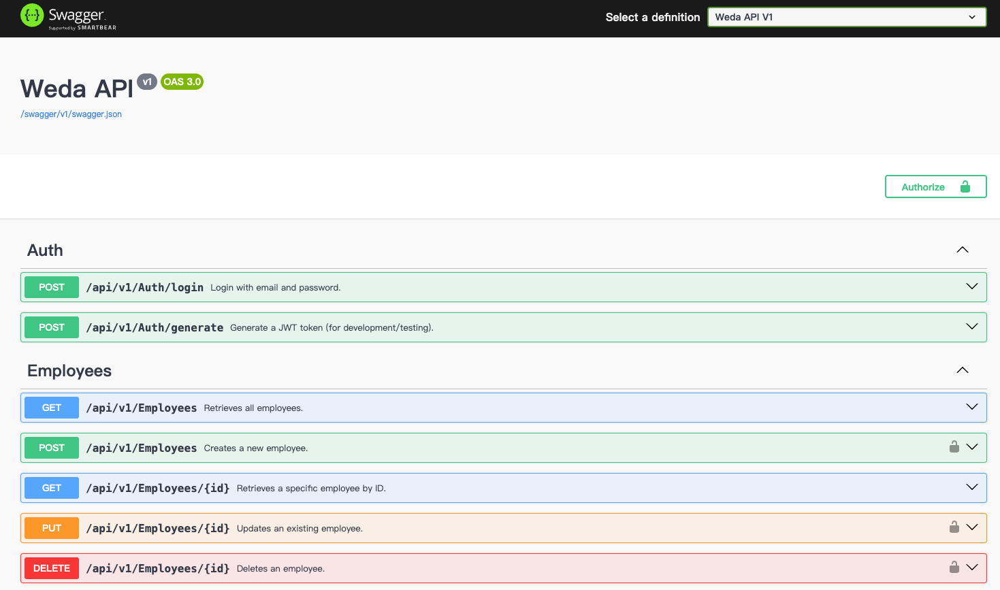
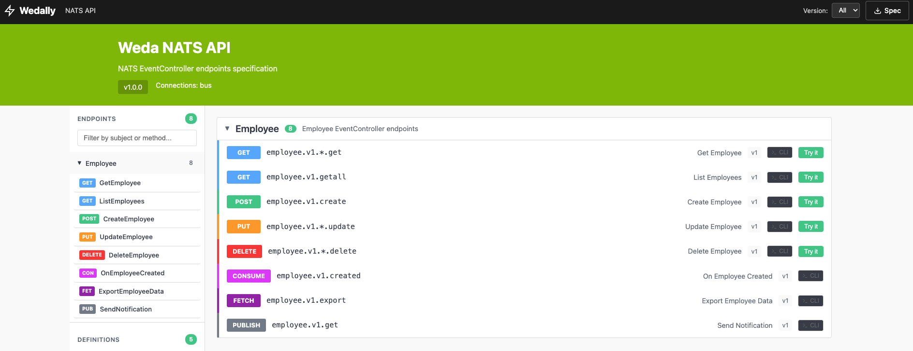
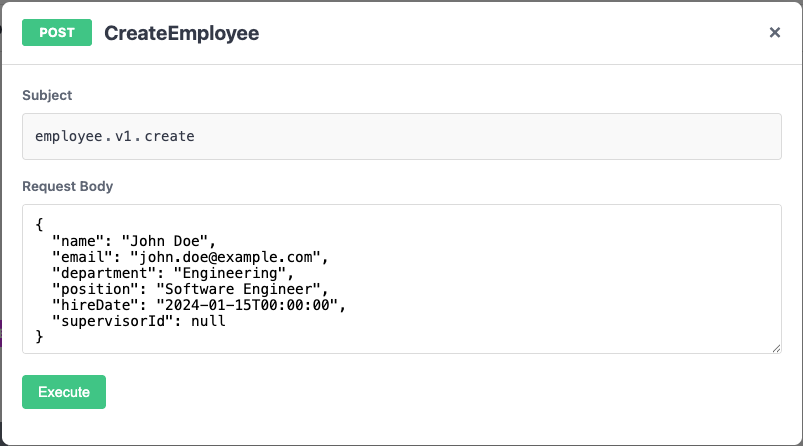
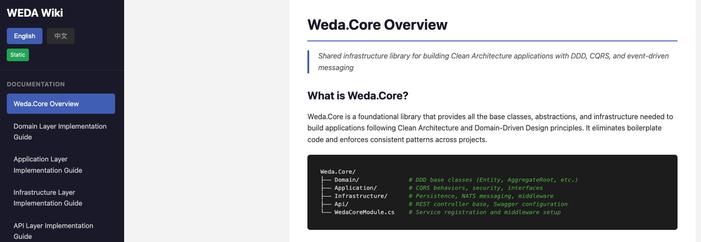

# ClawOS

[中文版](README_zh.md)

An AI Agent Operating System built with .NET 10, featuring Clean Architecture (DDD, CQRS), multi-user workspace isolation, distributed scheduling, and a modular tool/skill/channel plugin system.

## Features

- **Clean Architecture** — Layered with clear separation of concerns (Api / Application / Domain / Infrastructure)
- **Domain-Driven Design** — Entities, Value Objects, Aggregate Roots, Domain Events
- **CQRS Pattern** — Command Query Responsibility Segregation with Mediator
- **Agent Pipeline** — Middleware-based LLM invocation with error handling, logging, timeout, secret redaction
- **Tool Plugin System** — Auto-registered C# tools via assembly scanning (`AgentToolBase<TArgs>`)
- **Markdown Skills** — Declarative `SKILL.md` definitions composing tools with LLM instructions
- **Multi-Channel** — Web UI (SSE), Telegram Bot, extensible adapter pattern (`IChannelAdapter`)
- **Distributed CronJob** — NATS JetStream + Leader Election for scheduled task execution
- **Two-Layer Model Provider** — Global (SuperAdmin) + Per-user LLM providers
- **Multi-User Isolation** — Per-user workspace, EF Core query filters, encrypted config storage
- **RBAC** — User / Admin / SuperAdmin with fine-grained permissions
- **NATS Messaging** — Dual-broker architecture (Protobuf broker + JSON bus)
- **Distributed Cache** — NATS KV-based `IDistributedCache`
- **Object Store** — NATS Object Store for binary files
- **SAGA Pattern** — Distributed transaction orchestration with compensation
- **Observability** — OpenTelemetry tracing and metrics (Prometheus + Grafana)
- **Audit Logging** — Persistent audit trail for security-critical operations
- **Security** — JWT, AES-256 encryption, CSP, login rate limiting, path traversal protection

## Preview

### Developer UI
Developer-friendly UI including Swagger UI, Wedally UI, and Wiki:


### Pre-configured Swagger UI
Swagger UI with Grouping, Tags, and SecurityRequirement settings:


### NATS Endpoint UI (Wedally UI)
Swagger-like UI for NATS endpoints with direct interaction support:



### Auto-generated Wiki Pages
Converts articles from `docs/wiki/{en,zh}` to static web pages with markdown rendering:


## Project Structure

```
ClawOS/
├── src/
│   ├── ClawOS.Api/                       # ASP.NET Core API + Static Frontend
│   ├── ClawOS.Application/               # Business logic, Agent pipeline, CronJob executor
│   ├── ClawOS.Contracts/                 # Interfaces, DTOs, Tool/Skill/Channel contracts
│   ├── ClawOS.Domain/                    # Domain entities
│   ├── ClawOS.Infrastructure/            # EF Core, Security, Persistence
│   ├── ClawOS.Infrastructure.Llm.OpenAI/ # OpenAI LLM provider
│   ├── ClawOS.Infrastructure.Llm.Ollama/ # Ollama LLM provider
│   ├── ClawOS.Hosting/                   # DI composition, service registration
│   ├── ClawOS.Channels.Telegram/         # Telegram Bot channel adapter
│   ├── ClawOS.Cli/                       # CLI interface
│   └── tools/                            # Built-in tool plugins
│       ├── ClawOS.Tools.FileSystem/
│       ├── ClawOS.Tools.Shell/
│       ├── ClawOS.Tools.Git/
│       ├── ClawOS.Tools.GitHub/
│       ├── ClawOS.Tools.AzureDevOps/
│       ├── ClawOS.Tools.Http/
│       ├── ClawOS.Tools.WebSearch/
│       ├── ClawOS.Tools.Notion/
│       ├── ClawOS.Tools.Pdf/
│       ├── ClawOS.Tools.ImageGen/
│       ├── ClawOS.Tools.Tmux/
│       └── ClawOS.Tools.Preference/
├── skills/                               # Markdown-based skill definitions
├── tests/
│   ├── ClawOS.Api.IntegrationTests/
│   ├── ClawOS.Application.UnitTests/
│   ├── ClawOS.Domain.UnitTests/
│   ├── ClawOS.Infrastructure.UnitTests/
│   └── ClawOS.TestCommon/
├── docs/                                 # Wiki documentation
├── docker-compose.yml
└── Dockerfile
```

## Getting Started

### Prerequisites

- [.NET 10 SDK](https://dotnet.microsoft.com/download)
- Docker & Docker Compose

### Run with Docker Compose (Recommended)

```bash
cp .env.example .env  # Edit with your values
docker compose up -d
```

| Service | URL |
|---------|-----|
| Web UI | http://localhost:5001 |
| Swagger UI | http://localhost:5001/swagger |
| SearXNG | http://localhost:8080 |
| PostgreSQL | localhost:5433 |

### Local Development

```bash
# Start infrastructure services
docker compose up -d postgres nats-broker nats-bus searxng

# Run the API
dotnet run --project src/ClawOS.Api
```

### Database Migrations

Migrations are automatically applied on startup. To create a new migration:

```bash
dotnet ef migrations add MigrationName \
  --project src/ClawOS.Infrastructure \
  --startup-project src/ClawOS.Api
```

## Creating Extensions

### Tool (C#)

Tools provide executable capabilities (file I/O, API calls, shell commands, etc.):

```csharp
public class MyTool(IServiceProvider sp) : AgentToolBase<MyToolArgs>
{
    public override string Name => "my_tool";
    public override string Description => "What this tool does";

    public override async Task<ToolResult> ExecuteAsync(
        MyToolArgs args, ToolContext context, CancellationToken ct)
    {
        return ToolResult.Success("Result");
    }
}

public record MyToolArgs(
    [property: Description("Parameter description")]
    string? Parameter
);
```

Place under `src/tools/` — auto-registered via assembly scanning at startup.

### Skill (Markdown)

Skills compose tools with LLM instructions:

```markdown
---
name: my-skill
description: What this skill does
tools:
  - shell
  - read_file
---

## Instructions

You are a helpful assistant that...
```

Place under `skills/` — invoke via `@my-skill` in chat or reference in CronJob context.

### Channel Adapter

Implement `IChannelAdapter` + `IHostedService` to bridge external messaging platforms:

```csharp
public interface IChannelAdapter
{
    string Name { get; }
    string DisplayName { get; }
    ChannelAdapterStatus Status { get; }
    Task SendMessageAsync(string externalId, string message, CancellationToken ct);
}
```

## API Overview

### Chat & Conversations
- `POST /api/v1/chat/stream` — Stream chat response (SSE)
- `GET/POST/DELETE /api/v1/conversation` — Manage conversations

### Model Providers
- `GET/POST/PUT/DELETE /api/v1/model-provider` — Global providers (SuperAdmin)
- `GET/POST/PUT/DELETE /api/v1/user-model-provider` — Per-user providers

### CronJobs
- `GET/POST/PUT/DELETE /api/v1/cron-job` — Manage scheduled jobs
- `POST /api/v1/cron-job/{id}/execute` — Manual trigger

### Configuration
- `GET/PUT/DELETE /api/v1/user-config/{key}` — Per-user encrypted config
- `GET/PUT/DELETE /api/v1/app-config/{key}` — Global app config (SuperAdmin)

### User Management
- `POST /api/v1/auth/login` — Login
- `POST /api/v1/auth/register` — Register
- `GET/POST /api/v1/user-management` — User admin (SuperAdmin)

## NATS Integration

ClawOS uses dual NATS brokers:
- **Broker** (port 4222): Protobuf serialization, LLM coordination
- **Bus** (port 4223): JSON serialization, event distribution, CronJob dispatch

### EventController Pattern

```csharp
[ApiVersion("1")]
public class MyEventController : EventController
{
    [Subject("[controller].v{version:apiVersion}.{id}.get")]
    public async Task<MyResponse> GetById(int id)
    {
        var result = await Mediator.Send(new GetByIdQuery(id));
        return new MyResponse(result.Value);
    }
}
```

## Configuration

### Environment Variables

| Variable | Description |
|----------|-------------|
| `JWT_SECRET` | JWT signing key (>= 32 chars) |
| `CLAWOS_ENCRYPTION_KEY` | AES-256 key for encrypted config |
| `LLM_PROVIDER` | Default provider (`ollama` / `openai`) |
| `OPENAI_API_KEY` | OpenAI API key |
| `OLLAMA_URL` | Ollama server URL |
| `SEARXNG_URL` | SearXNG URL for web search |

## Testing

```bash
dotnet test
```

### Test Types
- **Domain Unit Tests** — Entities and value objects
- **Application Unit Tests** — Handlers and pipeline behaviors
- **Infrastructure Unit Tests** — Repositories and persistence
- **Integration Tests** — End-to-end API testing

## Tech Stack

| Layer | Technology |
|-------|-----------|
| Backend | .NET 10, ASP.NET Core, EF Core, Mediator (CQRS) |
| Database | PostgreSQL with auto-migration |
| Messaging | NATS JetStream (dual broker) |
| Search | SearXNG |
| Channels | Web UI (SSE), Telegram Bot |
| Frontend | Vanilla JS (CSP-compliant), marked.js, highlight.js, KaTeX |
| Security | JWT, AES-256, CSP, Audit Logging, Rate Limiting |
| Observability | OpenTelemetry, Prometheus, Grafana |
| Container | Docker, Docker Compose |
| Framework | Weda.Core (DDD, CQRS, SAGA, Distributed Cache) |

## License

MIT
